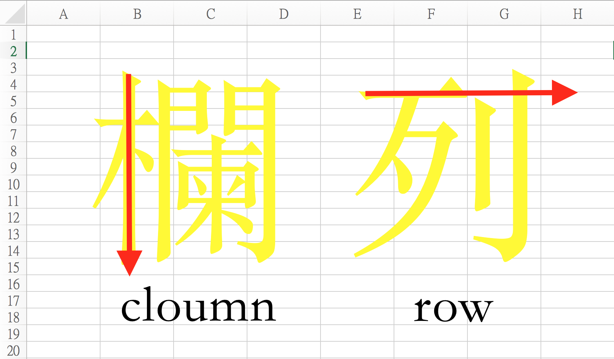
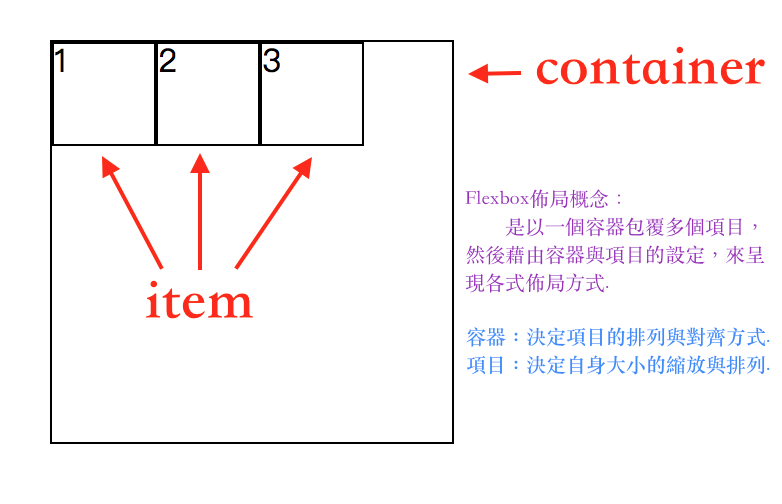
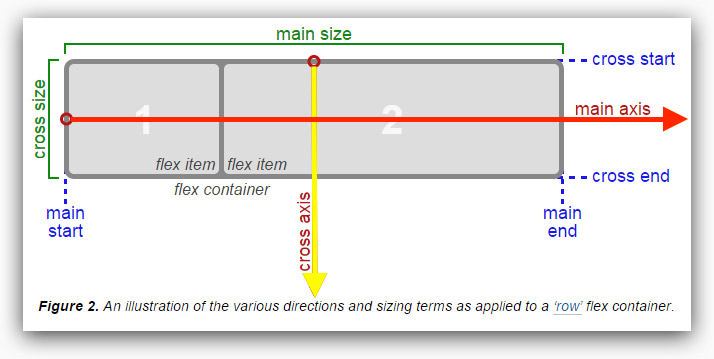
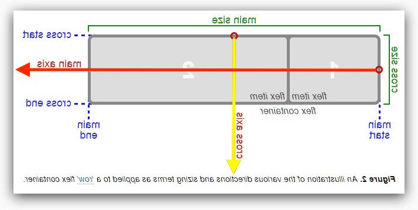
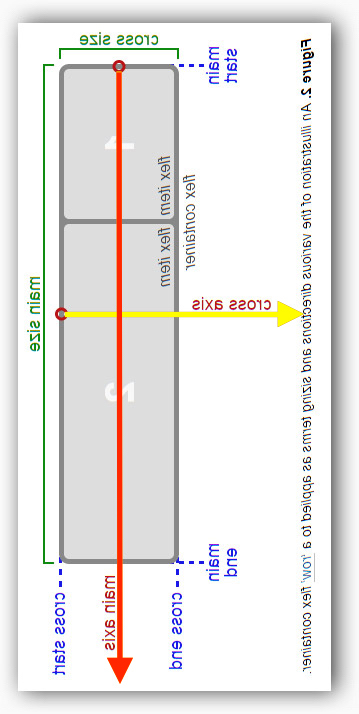
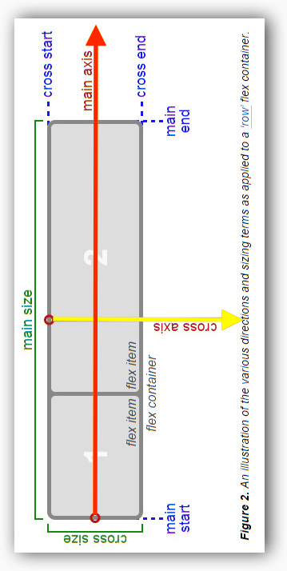

# Flexbox

## ㄧ、Column Row 認識

- column(欄)(方向為上到下)
- row(列)(方向為左到右)

 

## 二、容器與項目(container && item) 認識

## 三、排列方式&主軸&交叉軸 概念

### I.flexbox：排列方式分為四種(加上reverse為相反方向)

- row：從左到右.
- row-reverse：從右到左.
- column：從上到下.
- column-reverse：從下到上.

### II.理解排列方式與主軸和交叉軸的關係

 <a href="https://scotch.io/tutorials/a-visual-guide-to-css3-flexbox-properties" target="_blank">圖片來源 </a>  

- main-axis：主軸 
- main-start：主軸-起點邊界
- main-end：主軸-結束邊界
- main-size：項目與容器的主軸大小
- cross-axis：交叉軸 
- cross-start：交叉軸-起點邊界
- cross-end：交叉軸-結束邊界
- cross-size：項目與容器的交叉軸大小

PS：主軸的方向並不是固定的，而是由排列方式來決定主軸(main-axis)的方向，另外與主軸垂直的稱為交叉軸(cross-axis).

1.row 圖示 (排列方向為從左到右)

<a href="https://www.w3.org/TR/css-flexbox-1/#box-model" target="_blank">圖示來源</a> 
 
 

2.row-reverse 圖示 (排列方向為從右到左)  
(以下圖示：紅色箭頭=main-axis、黃色箭頭=main-size)
  
PS:其實就是主軸方向翻轉，而交叉軸的方向不變.

 

3.column 圖示 (排列方向為從上到下)  
  
PS:column排列方式為上到下，所以主軸方向(main-axis)就會變成上到下.  

 

4.column-reverse 圖示 (排列方向為從下到上)  

 

|   排列方式  |  主軸方向  |   交叉軸方向  |
| :------| :------|:------|
| row | 從左到右 | 從上到下|
| row-reverse | 從右到左 | 從上到下|
| column | 從上到下 | 從左到右|
| column-reverse | 從下到上 | 從左到右|
 
> ㄧ ~ 三 介紹的都是在講flexbox的相關概念，再來就是藉由flexbox語法上的實作，來理解屬性上的設定與應用.

 

## 四、容器相關屬性 (container)

|   屬性  |   作用  | 範例  |
| :------| :------|:------|
|  display | 設定為flexbox佈局 |<a href="https://jiahongl.github.io/flexbox-demo/dist/#example" target="_blank">demo</a>  |
|  flex-direction | 項目 排列方向 |<a href="https://jiahongl.github.io/flexbox-demo/dist/#example2" target="_blank">demo</a>  |
|  flex-wrap | 項目 換行方式 |<a href="https://jiahongl.github.io/flexbox-demo/dist/#example3" target="_blank">demo</a>  |
|  justify-content | 項目 主軸對齊方式 |<a href="https://jiahongl.github.io/flexbox-demo/dist/#example4" target="_blank">demo</a>  |
|  align-items | 項目 交叉軸對齊方式(單行) |<a href="https://jiahongl.github.io/flexbox-demo/dist/#example5" target="_blank">demo</a>  |
|  align-content | 項目 交叉軸對齊方式(多行) |<a href="https://jiahongl.github.io/flexbox-demo/dist/#example6" target="_blank">demo</a>  |

|   屬性合併  |  作用  | 範例  |
| :------| :------|:------|
|  flex-flow| direction + wrap|<a href="https://jiahongl.github.io/flexbox-demo/dist/#example12" target="_blank">demo</a>  |

<table>
   <tr>
      <td>屬性名稱</td>
      <td colspan="2">說明</td>
   </tr>
   <tr>
      <td></td>
      <td>參數</td>
      <td>功能</td>
   </tr>
   <tr>
      <td>display</td>
      <td colspan="2">設定為flexbox佈局</td>
   </tr>
   <tr>
      <td></td>
      <td>flex</td>
      <td>被設定元素會有block的特性</td>
   </tr>
   <tr>
      <td></td>
      <td>inline-flex</td>
      <td>被設定元素會有inline-block的特性</td>
   </tr>
   <tr>
      <td>flex-direction</td>
      <td colspan="2">容器項目 排列方向</td>
   </tr>
   <tr>
      <td></td>
      <td>row (默認值)</td>
      <td>從左到右排列項目</td>
   </tr>
   <tr>
      <td></td>
      <td>row-reverse</td>
      <td>從右到左排列項目</td>
   </tr>
   <tr>
      <td></td>
      <td>column</td>
      <td>從上到下排列項目</td>
   </tr>
   <tr>
      <td></td>
      <td>column-reverse</td>
      <td>從下到上排列項目</td>
   </tr>
   <tr>
      <td>flex-wrap</td>
      <td colspan="2">容器項目 換行方式</td>
   </tr>
   <tr>
      <td></td>
      <td>nowrap (默認值)</td>
      <td>不換行</td>
   </tr>
   <tr>
      <td></td>
      <td>wrap</td>
      <td>換行 多餘項目排在下一行</td>
   </tr>
   <tr>
      <td></td>
      <td>wrap-reverse</td>
      <td>換行 多餘項目排在上一行</td>
   </tr>
   <tr>
      <td>justify-content</td>
      <td colspan="2">容器項目 主軸(main-axis)對齊方式</td>
   </tr>
   <tr>
      <td></td>
      <td>flex-start (默認值)</td>
      <td>往起始邊界對齊</td>
   </tr>
   <tr>
      <td></td>
      <td>center</td>
      <td>往中間對齊</td>
   </tr>
   <tr>
      <td></td>
      <td>flex-end</td>
      <td>往結束邊界對齊</td>
   </tr>
   <tr>
      <td></td>
      <td>space-between</td>
      <td>第一項目靠起始邊界.最後項目靠終點邊界.其餘空白平均分配剩下項目左右兩側</td>
   </tr>
   <tr>
      <td></td>
      <td>space-around</td>
      <td>將空白平均分配每個項目左右兩側</td>
   </tr>
   <tr>
      <td>align-items</td>
      <td colspan="2">容器項目 交錯軸(cross-axis)對齊方式</td>
   </tr>
   <tr>
      <td></td>
      <td>flex-start</td>
      <td>往起始邊界對齊</td>
   </tr>
   <tr>
      <td></td>
      <td>center</td>
      <td>往中間對齊</td>
   </tr>
   <tr>
      <td></td>
      <td>flex-end</td>
      <td>往結束邊界對齊</td>
   </tr>
   <tr>
      <td></td>
      <td>baseline</td>
      <td>每個項目基線對齊</td>
   </tr>
   <tr>
      <td></td>
      <td>stretch (默認值)</td>
      <td>將項目的cross-size撐開,填滿與容器相同cross-size.</td>
   </tr>
   <tr>
      <td>align-content</td>
      <td colspan="2">當有多行時.以行為單位的交錯軸(cross-axis)對齊方式</td>
   </tr>
   <tr>
      <td></td>
      <td>flex-start</td>
      <td>往起始邊界對齊</td>
   </tr>
   <tr>
      <td></td>
      <td>center</td>
      <td>往中間對齊</td>
   </tr>
   <tr>
      <td></td>
      <td>flex-end</td>
      <td>往結束邊界對齊</td>
   </tr>
   <tr>
      <td></td>
      <td>space-between</td>
      <td>第一行靠起始邊界.最後行靠結束邊界.其餘空白平均分配剩下每行左右兩側</td>
   </tr>
   <tr>
      <td></td>
      <td>stretch (默認值)</td>
      <td>將每行的cross-size撐開.填滿與容器相同cross-size</td>
   </tr>
</table>

 

## 五、項目相關屬性 (item)

|   屬性  |   作用  | 範例  |
| :------| :------|:------|
|  flex-basis | 項目初始大小 (main-size) |<a href="https://jiahongl.github.io/flexbox-demo/dist/#example7" target="_blank">demo</a>  |
|  flex-grow | 項目增長比例. |<a href="https://jiahongl.github.io/flexbox-demo/dist/#example8" target="_blank">demo</a>  |
|  flex-shrink | 項目壓縮比例. |<a href="https://jiahongl.github.io/flexbox-demo/dist/#example9" target="_blank">demo</a>  |
|  order | 項目排列順序 |<a href="https://jiahongl.github.io/flexbox-demo/dist/#example10" target="_blank">demo</a>  |
|  align-self|項目本身 交叉軸對齊方式(覆蓋容器align-items的設定) |<a href="https://jiahongl.github.io/flexbox-demo/dist/#example11" target="_blank">demo</a>  |

|   屬性合併  |   作用  |範例  |
| :------| :------|:------|
|  flex| grow + shrink + basis|<a href="https://jiahongl.github.io/flexbox-demo/dist/#example13" target="_blank">demo</a>  |

<table>
    <thead>
        <tr >
            <td>屬性名稱</td>
            <td colspan="2">說明</td>
        </tr>
        <tr>
            <td></td>
            <td>參數</td>
            <td>功能</td>
        </tr>
   </thead>
   <tbody>
        <tr>
            <td>flex-basis</td>
            <td colspan="2">項目初始大小(main-size)</td>
        </tr>
        <tr>
            <td></td>
            <td>auto 或 0 (默認值)</td>
            <td>項目原始大小</td>
        </tr>
        <tr>
            <td></td>
            <td>元素單位</td>
            <td>如：%、em、rem、px</td>
        </tr>
        <tr>
            <td>flex-grow</td>
            <td colspan="2">項目增長比例</td>
        </tr>
        <tr>
            <td></td>
            <td>數字(默認值:0)</td>
            <td>依照數字比例彈性增長</td>
        </tr>
        <tr>
            <td></td>
            <td>0</td>
            <td>不做彈性增長</td>
        </tr>
        <tr>
            <td>flex-shrink</td>
            <td colspan="2">項目壓縮比例</td>
        </tr>
        <tr>
            <td></td>
            <td>數字 (默認值:1)</td>
            <td>依照數字比例彈性壓縮</td>
        </tr>
        <tr>
            <td></td>
            <td>0</td>
            <td>不做彈性壓縮</td>
        </tr>
        <tr>
            <td>order</td>
            <td colspan="2">項目排列順序</td>
        </tr>
        <tr>
            <td></td>
            <td>數字(默認值:0)</td>
            <td>數字越小排越前面</td>
        </tr>
        <tr>
            <td>align-self</td>
            <td colspan="2">項目本身 交叉軸對齊方式(覆蓋容器align-items的設定)</td>
        </tr>
        <tr>
            <td></td>
            <td>flex-start</td>
            <td>往起始邊界對齊</td>
        </tr>
        <tr>
            <td></td>
            <td>center</td>
            <td>往中間對齊</td>
        </tr>
        <tr>
            <td></td>
            <td>flex-end</td>
            <td>往結束邊界對齊</td>
        </tr>
        <tr>
            <td></td>
            <td>baseline</td>
            <td>每個項目基線對齊</td>
        </tr>
        <tr>
            <td></td>
            <td>stretch (默認值)</td>
            <td>將項目的cross-size撐開.填滿與容器相同cross-size</td>
        </tr>
   </tbody>
</table>

<table>
    <thead>
        <tr >
            <td>合併屬性</td>
            <td>參數</td>
            <td >簡化</td>
            <td >說明</td>
        </tr>
   </thead>
    <tbody>
        <tr>
            <td>flex</td>
            <td colspan="3">flex-grow + flex-shrink + flex-basis</td>
        </tr>
        <tr>
            <td></td>
            <td>0 1 auto </td>
            <td>flex:initial</td>
            <td>flex項目默認設定</td>
        </tr>
        <tr>
            <td></td>
            <td>0 0 auto</td>
            <td> flex:none;</td>
            <td>固定main-size.為項目原始的main-size</td>
        </tr>
        <tr>
            <td></td>
            <td>1 1 auto</td>
            <td>flex:auto;</td>
            <td>main-size自動彈性</td>
        </tr>
    </tbody>
<table>

 

## 六、範例

### 1.範例一

<a href="https://jiahongl.github.io/flexbox-demo/dist/#example14" target="_blank">置中對齊 </a>

### 2.範例二 

<a href="https://jiahongl.github.io/flexbox-demo/dist/#example15" target="_blank">常見佈局</a>